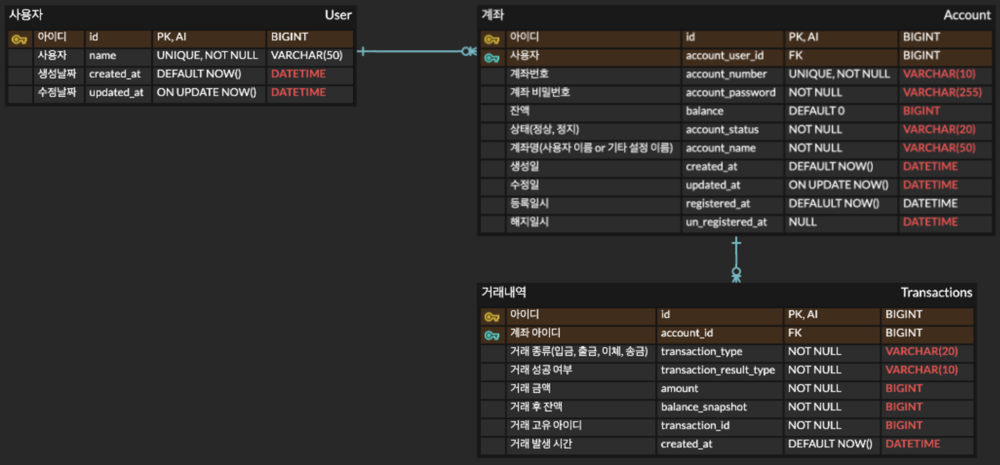

# 정책 및 API 설계

### 0. 공통
- JSON 네이밍 컨벤션 : 모든 요청 및 응답 필드는 스네이크 케이스 적용
- 타임스탬프 형식 : yyyy-MM-dd HH:mm:ss (UTC 기준)
- 실패응답 : 상태코드, 에러코드, 에러 메세지

### 1. 계좌 생성
- 정책
  - 사용자에 대한 계좌 생성
  - 1명의 사용자에 대해 최대 10개의 계좌 생성 가능
  - 계좌번호는 10자리 형태로 생성
  - 계좌명은 최대 10글자 입력 가능(한,영,특수문자,숫자 포함 가능) 
  - 계좌명 미입력시 사용자의 이름을 계좌명으로 설정
  - 동일 사용자의 중복 계좌명 허용
- API : POST /account
- 파라미터 : 사용자 아이디, 계좌 비밀번호, 초기 잔액, 계좌명
- 성공응답 : 사용자 아이디, 계좌번호, 계좌명, 등록일시

### 2. 계좌 해지
- 정책
  - 사용자 또는 계좌가 없는 경우 실패
  - 사용자 아이디, 계좌번호, 계좌 비밀번호 불일치시 실패
  - 계좌가 이미 해지 상태인 경우 실패
  - 잔액이 있는 경우 실패
- API : DELETE /account
- 파라미터 : 사용자 아이디, 계좌번호, 계좌 비밀번호
- 성공응답 : 사용자 아이디, 계좌번호, 해지일시

### 3. 계좌 확인
- 정책
  - 사용자에 대한 계좌의 정보(계좌번호, 잔액, 계좌명)들을 응답
  - 사용자가 없는 경우 실패
- API : GET /account?user_id={userId}
- 파라미터 : 사용자 아이디
- 성공응답 : List<계좌번호, 잔액, 계좌명>

### 4. 잔액 사용
- 정책
  - 사용자가 없는 경우 실패
  - 사용자 아이디와 계좌 소유주가 다른 경우 실패
  - 계좌번호와 계좌 비밀번호가 불일치인 경우 실패
  - 계좌가 이미 해지된 경우 실패
  - 거래금액이 잔액보다 큰 경우 실패
  - 거래금액이 너무 작거나(1000 이하) 큰(1억) 경우 실패
- API : POST /transaction/use
- 파라미터 : 사용자 아이디, 계좌번호, 계좌 비밀번호, 거래 금액
- 성공응답 : 계좌번호, 거래 결과 코드(성공/실패), 거래 아이디, 거래금액, 거래일시

# ERD

